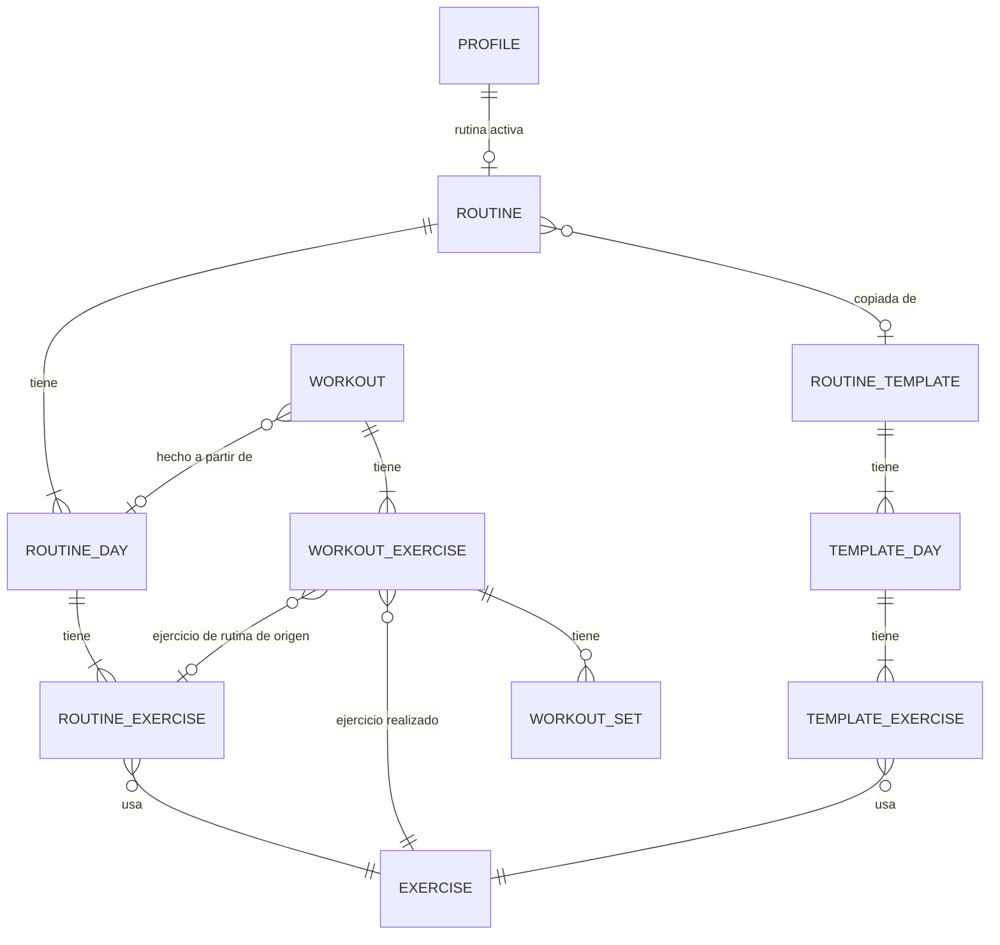

# 06 — Modelo de dominio

Entidades, relaciones e invariantes **del dominio**, independientes de cómo se guardan. El esquema físico, local y remoto, está en [07-datos-y-sincronizacion.md](07-datos-y-sincronizacion.md). Los nombres siguen el [glosario](01-glosario.md).

## 1. Mapa de entidades

## 2. Agregados

Un **agregado** es un conjunto de entidades que se modifica como una unidad y protege sus invariantes. Define también los límites de las transacciones locales.

| Agregado | Raíz | Contiene | Dueño | Se sincroniza |
|---|---|---|---|---|
| **Perfil** | `Profile` | preferencias, incrementos, rutina activa | Usuario | ✅ |
| **Rutina** | `Routine` | `RoutineDay`, `RoutineExercise` | Usuario | ✅ |
| **Entrenamiento** | `Workout` | `WorkoutExercise`, `WorkoutSet` | Usuario | ✅ |
| **Ejercicio** | `Exercise` | fuentes y atribución | Catálogo (equipo) | ⬇️ solo descarga |
| **Plantilla** | `RoutineTemplate` | `TemplateDay`, `TemplateExercise` | Catálogo (equipo) | ⬇️ solo descarga |

Entre agregados las referencias son **solo por ID**. Por ejemplo, un `WorkoutExercise` guarda el `exerciseId`, no una copia del ejercicio.

## 3. Entidades

### Profile

`id = userId` (RN-AUTH-06): hay un solo perfil por usuario.

| Atributo | Tipo | Notas |
|---|---|---|
| `level` | `novice \| intermediate \| advanced` | |
| `goal` | `health \| hypertrophy \| strength` | |
| `daysPerWeek` | 2–6 | |
| `unit` | `kg \| lb` | Solo afecta la presentación (RN-PERF-05) |
| `effortMode` | `simple \| rir` | |
| `effortModeExplicit` | boolean | Si el usuario lo eligió a mano (RN-PERF-04) |
| `loadIncrementsKg`, `loadIncrementsLb` | mapa equipamiento → incremento, uno por unidad | RN-PERF-06 |
| `barWeightKg`, `barWeightLb` | peso de la barra, uno por unidad (20 kg · 45 lb por defecto) | Carga mínima con barra (RN-PERF-08). Como los incrementos, cambiar de unidad no lo convierte |
| `activeRoutineId` | ID? (referencia débil) | **La rutina activa vive en el perfil**, no como un flag en cada rutina (ver I-01, RN-RUT-02) |
| `onboardingCompletedAt` | fecha? | |

### Routine · RoutineDay · RoutineExercise

| Entidad | Atributos |
|---|---|
| `Routine` | `name`, `sourceTemplateId?` |
| `RoutineDay` | `routineId`, `name`, `position` |
| `RoutineExercise` | `routineDayId`, `exerciseId`, `position`, `role` (`main \| accessory`), `sets`, `repMin`, `repMax`, `restSeconds`, `targetRir`, `notes?` |

### Workout · WorkoutExercise · WorkoutSet

| Entidad | Atributos |
|---|---|
| `Workout` | `routineId?`, `routineDayId?` (referencias débiles), `routineNameSnapshot`, `dayNameSnapshot`, `status` (`in_progress \| finished`), `startedAt`, `finishedAt?`, `notes?` |
| `WorkoutExercise` | `workoutId`, `routineExerciseId?`, `plannedExerciseId?` (el ejercicio que estaba planificado), `exerciseId` (el realizado), `position`, `status` (`pending \| done \| skipped`), **copia de la prescripción**: `role`, `sets`, `repMin`, `repMax`, `restSeconds`, `targetRir`; **copia de atributos**: `loadType`, `isUnilateral` (RN-ENT-08) |
| `WorkoutSet` | `workoutExerciseId`, `position`, `loadKg?`, `isWarmup`, `completedAt`, y **según lateralidad**: • Bilateral: `reps`, `rir?` • Unilateral: `repsLeft`, `repsRight`, `rirLeft?`, `rirRight?` (ADR-0008) |

- Descartar un entrenamiento = **borrado lógico** del agregado. No existe un estado `discarded`.
- Una **sustitución** se reconoce cuando `exerciseId ≠ plannedExerciseId` (RN-ENT-10). Se compara contra la copia, no contra la rutina actual, para que cambiar el ejercicio de la rutina no reescriba el historial (RN-RUT-08).
- Sustituir **crea un nuevo** `WorkoutExercise`. El original conserva sus series (RN-ENT-10).
- Un **ejercicio no planificado** (Could) es un `WorkoutExercise` sin `routineExerciseId` ni `plannedExerciseId`.

### Exercise (catálogo)

El modelo canónico de ADR-0004: `slug`, `name`, `aliases`, `loadType`, `primaryMuscles`, `secondaryMuscles`, `primaryEquipment` (para el incremento), `equipment` (lista, para los filtros), `mechanic`, `isUnilateral`, `description?`, `attributions[]`, `deprecatedAt?`.

### RoutineTemplate · TemplateDay · TemplateExercise (catálogo)

Solo **estructura**: días, ejercicios, orden, `role` y `sets`. **No tienen prescripción:** se calcula al adoptar la plantilla (RN-PERF-03). Metadatos: `level`, `daysPerWeek`, `estimatedMinutes`, `rationale` (el texto de "¿Por qué esta rutina?", con referencias a `P-NN`).

## 4. Datos derivados (no son entidades)

Se calculan en la capa de dominio y **no se guardan** (RN-SYNC-10, ADR-0009):

| Dato | Función de dominio | Regla |
|---|---|---|
| Próximo día | `nextDay(routine, workouts)` | RN-RUT-01 |
| Exposiciones de un ejercicio (EE) | `exerciseExposures(exerciseId, workouts)` | RN-SUG-01 |
| Exposiciones de un ejercicio de rutina (ERR) | `routineExposures(routineExercise, workouts)` | RN-SUG-01 |
| Sugerencia | `suggest(fold(ERR), ctx)` con las entradas de RN-SUG-17 | RN-SUG-* |
| e1RM, récords | `e1rm(set)`, `personalRecords(exercise, workouts)` | RN-SUG-07, RN-PROG-03 |
| Volumen semanal | `weeklyVolume(workouts, week)` | RN-PROG-04 |
| Prescripción de una plantilla adoptada | `prescribe(template, profile)` | RN-PERF-03 |

## 5. Invariantes

| ID | Invariante | Dónde se protege |
|---|---|---|
| I-01 | Hay como máximo **una rutina activa**, porque es un único campo `Profile.activeRoutineId`. Esto evita que dos dispositivos marquen dos rutinas activas a la vez con LWW. | Modelo |
| I-02 | Una rutina tiene 1–7 días y cada día 1–20 ejercicios (RN-RUT-05). | Dominio (al guardar) |
| I-03 | `repMin ≤ repMax`, y los demás límites de RN-RUT-04. | Dominio + CHECK en la base |
| I-04 | Hay como máximo **un entrenamiento `in_progress`** en el dispositivo (RN-ENT-01). Nunca se sincroniza (RN-SYNC-13). | Dominio (caso de uso "iniciar") + sync |
| I-05 | Una serie de un ejercicio **unilateral** usa solo los campos por lado, y una **bilateral** solo `reps` y `rir`. La lateralidad es la **copiada** en el `WorkoutExercise`, así que un cambio en el catálogo no invalida el historial (RN-CAT-05). | Dominio + CHECK |
| I-06 | En un ejercicio de **peso corporal**, `loadKg` es nulo. En uno de **carga externa**, no lo es (RN-ENT-02). | Dominio |
| I-07 | Borrar lógicamente una raíz de agregado borra lógicamente a sus hijos en la **misma transacción** local. Además, las lecturas tratan como borrado a todo hijo de un padre borrado (RN-SYNC-12). | Repositorio + consultas |
| I-08 | El historial nunca se borra como efecto de editar o borrar una rutina (RN-RUT-07). Los entrenamientos referencian la rutina solo por ID, y la copia de la prescripción mantiene el sentido de los datos. | Modelo |
| I-09 | Un ejercicio del catálogo nunca se borra físicamente (RN-CAT-01). | Seed |
| I-10 | El orden se resuelve por `(position, id)`. Así, si dos dispositivos reordenan a la vez, el resultado sigue siendo determinista, aunque haya posiciones repetidas. | Dominio (al leer) |
| I-11 | Una serie de calentamiento no es efectiva (RN-ENT-12). | Dominio |

## 6. Casos de uso (capa de dominio)

Son el punto de entrada desde los ViewModel ([12-arquitectura](12-arquitectura.md)). Cada uno es una función o clase con dependencias inyectadas a través de interfaces de repositorio.

| Caso de uso | RF |
|---|---|
| `CompleteOnboarding`, `RecommendTemplate`, `UpdateProfile` | RF-PERF-01..06 |
| `SearchExercises`, `GetExercise` | RF-CAT-01, 02 |
| `AdoptTemplate`, `SaveRoutine`, `ReorderRoutine`, `ActivateRoutine`, `DeleteRoutine` | RF-RUT-* |
| `GetHome` (próximo día + sugerencias), `StartWorkout`, `LogSet`, `EditSet`, `DeleteSet`, `SkipExercise`, `SubstituteExercise`, `FinishWorkout`, `DiscardWorkout`, `ResumeWorkout` | RF-ENT-* |
| `GetSuggestion`, `ExplainSuggestion` | RF-SUG-* |
| `GetHistory`, `GetWorkoutDetail`, `EditPastWorkout`, `GetExerciseProgress`, `GetPersonalRecords`, `GetWeeklyVolume` | RF-PROG-* |
| `ContinueAsGuest`, `SignUp`, `SignIn`, `SignInWithGoogle`, `MigrateGuestData`, `SignOut`, `ResetPassword` | RF-AUTH-* |
| `SyncNow`, `GetSyncStatus` | RF-SYNC-* |
