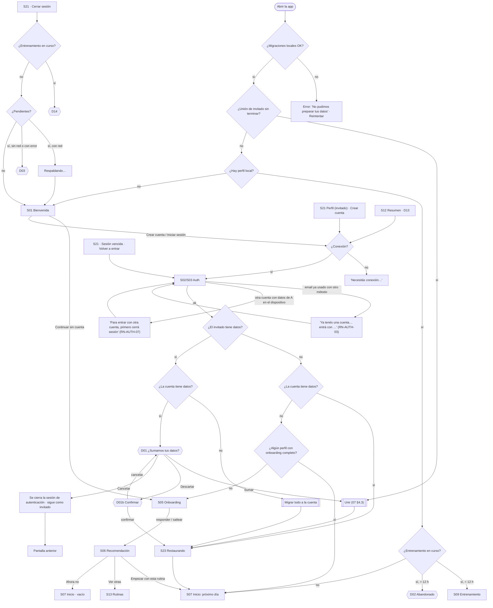
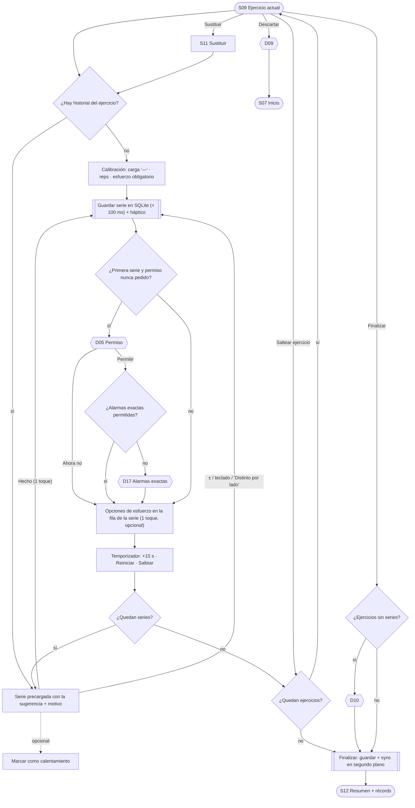

# 08 — Flujos y pantallas

Responde a los §4.8 (UI/UX/CX) y §4.9 (flujo de pantallas) del TPO. Es la **guía para el diseño en Figma**: cada pantalla lista sus estados y cada estado se tiene que dibujar. Los textos están en [13-textos.md](13-textos.md).

## 1. Principios de experiencia (derivados del contexto de uso)

| ID | Principio | Por qué | Cómo se verifica |
|---|---|---|---|
| UX-01 | **Un toque para el caso común** (confirmar una serie sugerida) | Entre series hay poca atención y una mano libre | RF-ENT-02 AC1 |
| UX-02 | **Blancos táctiles de ≥ 48 dp**, y los principales del entrenamiento de ≥ 56 dp | Dedos transpirados y teléfono en movimiento | RNF-16 |
| UX-03 | **Acción principal en la mitad inferior** de S09 | Uso con el pulgar de una mano | Revisión en Figma |
| UX-04 | **Nada interrumpe el entrenamiento** (sin modales de red ni de sync) | Contexto de uso | RNF-10 |
| UX-05 | **Siempre explicable** ("¿Por qué?") | OBJ-03 | RF-SUG-07 |
| UX-06 | **Lenguaje llano para el novato** | Usuario principal | 13-textos §1 |
| UX-07 | **Acciones destructivas con confirmación o "deshacer"** | Prevención y recuperación de errores | D01b, D03, D09, D11, snackbar |

## 2. Pantallas y diálogos

**Pestañas:** Inicio · Rutinas · Progreso · Perfil. El entrenamiento en curso es una pantalla completa **fuera de las pestañas**. Mientras está activo, hay una barra "Entrenamiento en curso" en todas las pestañas.

| ID | Pantalla | Tipo | RF principales |
|---|---|---|---|
| S01 | Bienvenida | Entrada | RF-AUTH-01 |
| S02 | Iniciar sesión | Pila de auth | RF-AUTH-03, 04 |
| S03 | Crear cuenta | Pila de auth | RF-AUTH-02, 04 |
| S04 | Recuperar contraseña (pedir enlace) | Pila de auth | RF-AUTH-08 |
| S24 | Nueva contraseña (desde el enlace) | Pila de auth | RF-AUTH-08 AC2, AC3 |
| S05 | Onboarding (3 pasos) | Entrada | RF-PERF-01 |
| S06 | Recomendación de plantilla | Entrada | RF-PERF-02 |
| S23 | Restaurando tus datos | Pantalla completa | RF-SYNC-03 |
| S07 | **Inicio: próximo día** | Pestaña Inicio | RF-ENT-01, RF-SUG-01 |
| S08 | Elegir día | Hoja modal | RF-ENT-01 AC3 |
| S09 | **Entrenamiento en curso** | Pantalla completa | RF-ENT-02..16, RF-SUG-02 |
| S10 | ¿Por qué esta sugerencia? | Hoja modal | RF-SUG-07 |
| S11 | Sustituir ejercicio | Hoja modal (buscador) | RF-ENT-09 |
| S12 | Resumen del entrenamiento | Pantalla | RF-ENT-11, RF-PROG-05 |
| S13 | Rutinas (Mis rutinas / Plantillas) | Pestaña Rutinas | RF-RUT-01, 07, 08 |
| S14 | Detalle de plantilla + "¿Por qué esta rutina?" | Pila | RF-RUT-01, 02 |
| S15 | Editor de rutina | Pila | RF-RUT-03..06 |
| S16 | Buscador de ejercicios | Pila o modal | RF-CAT-01 |
| S17 | Detalle de ejercicio | Pila | RF-CAT-02 |
| S18 | Progreso (Historial / Volumen) | Pestaña Progreso | RF-PROG-01, 06 |
| S19 | Detalle de entrenamiento (editable) | Pila | RF-PROG-02, 03 |
| S20 | Progreso de ejercicio | Pila | RF-PROG-04, 05 |
| S21 | Perfil y ajustes (incluye sync y cuenta) | Pestaña Perfil | RF-PERF-03..06, RF-SYNC-06, 07, RF-AUTH-07 |
| S22 | Acerca de y créditos | Pila | RF-CAT-05 |
| S25 | Cambios que no se pudieron respaldar | Pila (desde S21) | RF-SYNC-06 AC4 |

**Diálogos** (textos en 13 §8):

| ID | Diálogo | Se abre desde | RF |
|---|---|---|---|
| D01 / D01b | Unir los datos del invitado / confirmar descarte | S02, S03 | RF-AUTH-05 |
| D02 | Entrenamiento abandonado | Arranque | RF-ENT-13 AC2 |
| D03 | Cerrar sesión con pendientes | S21 | RF-AUTH-07 AC3 |
| D14 | Terminá tu entrenamiento primero (reemplaza a D04) | S21 (cerrar sesión), S13/S14 (activar, adoptar o eliminar la activa) | RF-AUTH-07 AC4, RN-RUT-09 |
| D05 | Permiso de notificaciones, en contexto | S09 (primera serie) | RF-ENT-06 AC9 |
| D17 | Permiso de alarmas exactas (Android 12+), después de D05 | S09 (primera serie), S21 | RF-ENT-06 AC9, AC10 |
| D06 | Ajustar la rutina al nuevo objetivo | S21 | RF-PERF-03 AC2 |
| D07 | Reemplazar la rutina activa | S14, S13 | RF-RUT-02 AC2, RF-RUT-07 |
| D08 | Cambios sin guardar | S15 | RF-RUT-03 AC5 |
| D09 | Descartar el entrenamiento | S09 | RF-ENT-12 |
| D10 | Finalizar con ejercicios pendientes | S09 | RF-ENT-11 AC2 |
| D11 | Eliminar rutina | S13 | RF-RUT-08 |
| D12 | Detalle de un cambio que no se pudo respaldar | S25 | RF-SYNC-06 AC4 |
| D13 | Sugerencia de crear cuenta | S12 | RF-AUTH-01 AC5 |
| D15 | ¿Activar esta rutina? | S15 (al guardar una rutina nueva) | RF-RUT-03 AC1 |
| D16 | Eliminar una serie o un entrenamiento pasado | S19 | RF-PROG-03 AC2, AC4 |

## 3. Flujo de entrada y cuenta

## 4. Flujo crítico: registrar un entrenamiento (caso de uso principal)

**Finales posibles:**
- El resumen del entrenamiento (éxito).
- La vuelta al inicio (entrenamiento descartado).
- La app cerrada a mitad de camino, que se retoma exactamente donde estaba (RF-ENT-13).

## 5. Anatomía de S09 (la pantalla más importante)

| Zona | Contenido |
|---|---|
| Encabezado | Nombre del día · tiempo transcurrido · menú (Descartar, Finalizar) · nota "Se respalda al finalizar" (si hay cuenta) |
| Ejercicio actual | Nombre · nota del ejercicio de rutina (RF-RUT-06) · prescripción ("3 × 8–12") · etiqueta "Unilateral" si corresponde · **motivo** de la sugerencia + "¿Por qué?" |
| Lista de series | Una fila por serie: carga · reps · esfuerzo · estado (pendiente, hecha, calentamiento atenuado). Tocar una serie hecha la abre para editar (RF-ENT-04) |
| Serie actual | La **fila de la serie actual** muestra la sugerencia ("62,5 kg × 8") y "Tocá para ajustar". **Hecho** (≥ 56 dp, abajo, UX-03) registra la sugerencia con un toque (UX-01). Tocar la fila abre la hoja **"Ajustar serie"**: pasos de **carga** (± incremento, con la convención "por mancuerna"/"total con barra") y de **repeticiones** (±) con su nota · interruptor "Es una serie de calentamiento" (oculto en calibración) · esfuerzo **opcional** ("¿Cuántas más podías hacer?") · **Hecho**, que registra la serie con lo ajustado. Unilateral: "Distinto por lado" y pasos Izq / Der. **Peso corporal:** sin campo de carga. El error de carga se muestra en el paso, dentro de la hoja (decisión de diseño, diseno/marca.md §12) |
| Después de "Hecho" | Si no se eligió el esfuerzo en la hoja, las **opciones de esfuerzo** aparecen en el descanso a pantalla completa y, si se minimiza, en la fila de esa serie. Siguen visibles hasta que se elige una o se confirma la serie siguiente. Después se puede cambiar tocando la serie. En unilaterales "divididos" hay dos filas de opciones (Izq / Der). En calibración quedan resaltadas y **bloquean la serie siguiente** hasta elegir una |
| Temporizador | Después de **Hecho** se abre el **descanso a pantalla completa**: cuenta regresiva grande con anillo de progreso · +15 s · Reiniciar · tarjeta de la serie recién hecha con las **opciones de esfuerzo** · "Siguiente: serie 2 de 3 · 62,5 kg × 8" · **Saltear descanso** · **Minimizar**. Minimizado, queda una **barra mínima** sobre Hecho (anillo, tiempo, siguiente serie, +15 s); tocarla vuelve a la pantalla completa. Al terminar: **"¡Descanso terminado!"** con vibración y **"Ir a la serie 2"** (decisión de diseño, diseno/marca.md §13) |
| Navegación | Deslizar o usar una lista de ejercicios para saltar a otro · "Saltear ejercicio" · "Sustituir" · "Agregar serie" |
| Avisos discretos | Permiso de notificaciones rechazado · Alarmas exactas no permitidas (RF-ENT-06 AC10) · (nunca errores de red, UX-04) |

### Anatomía de S07 (Inicio)

| Zona | Contenido |
|---|---|
| Encabezado | "Hoy toca: {día}" · rutina activa · "Cambiar día" |
| Lista de ejercicios | Por ejercicio: nombre · sugerencia ("62,5 kg × 8" o etiqueta **"Calibrar"**) · ícono de qué cambia (sube, suma reps, igual, vuelta de pausa). El motivo completo vive en S09 y S10 (decisión de diseño, diseno/marca.md §8) |
| Acción principal (abajo) | **Empezar**, o **Continuar entrenamiento** si hay uno en curso |
| Avisos | Restauración incompleta · pendientes o conflictos de sync (discretos) |

## 6. Estados por pantalla

Leyenda: ✅ se diseña · — no aplica. **"Carga"** es breve en casi todas las pantallas porque los datos son locales; se indica cuando hay red.

| Pantalla | Carga | Contenido | Vacío | Error | Sin conexión | Permisos | Estados propios |
|---|---|---|---|---|---|---|---|
| S01 Bienvenida | — | ✅ | — | — | ✅ (los botones de cuenta avisan al tocarlos) | — | — |
| S02/S03 Auth | ✅ "Ingresando…" (red) | ✅ formulario | — | ✅ credenciales · email existente · método distinto (RN-AUTH-03) · validación | ✅ "Necesitás conexión" | — | Google cancelado (vuelve sin error) |
| S04 Pedir enlace | ✅ enviando | ✅ | — | ✅ email inválido | ✅ | — | ✅ "Si existe una cuenta…" |
| S24 Nueva contraseña | ✅ guardando | ✅ | — | ✅ contraseña inválida · enlace inválido o vencido | ✅ | — | — |
| S05 Onboarding | — | ✅ pasos 1, 2 y 3 | — | — | ✅ igual | — | Retomar en el paso pendiente |
| S06 Recomendación | — | ✅ recomendación + por qué | — | — | ✅ | — | Variante novato con 4 o más días · intermedio con 5–6 · aviso "fuerza sin barra" (objetivo fuerza) |
| S23 Restaurando | ✅ indeterminado + cantidad de registros | — | — | ✅ se cortó: aviso + continuar usando | ✅ = error | — | — |
| S07 Inicio | ✅ esqueleto | ✅ próximo día + sugerencias | ✅ sin rutina activa | ✅ error de lectura local: Reintentar | ✅ igual + indicador de pendientes | — | Restauración incompleta · barra de entrenamiento en curso |
| S08 Elegir día | — | ✅ días con "hace N días" y el recomendado | — | — | ✅ | — | — |
| S09 Entrenamiento | — | ✅ precargada · editando · calibración (subir y bajar) · unilateral dividido · calentamiento · descanso corriendo · descanso terminado · esfuerzo simple vs. RIR · **peso corporal** · repeticiones extra (EXTEND_REPS) | — | ✅ valor inválido (en el campo) | ✅ **idéntico** | ✅ notificaciones rechazadas · alarmas exactas no permitidas | Ejercicio salteado · sustituido · último ejercicio · **ejercicio no disponible todavía** |
| S10 ¿Por qué? | — | ✅ versión novato · versión avanzado | — | — | ✅ | — | Uno por código de motivo (13 §4) |
| S11 Sustituir | — | ✅ mismo músculo primero + búsqueda | ✅ sin resultados | — | ✅ | — | — |
| S12 Resumen | — | ✅ con récords · sin récords | — | — | ✅ | — | Invitado: D13 |
| S13 Rutinas | ✅ | ✅ | ✅ sin rutinas propias | ✅ | ✅ | — | Rutina activa destacada |
| S14 Plantilla | — | ✅ + ¿por qué? | — | — | ✅ | — | Prescripción calculada para mi objetivo |
| S15 Editor | — | ✅ | ✅ día sin ejercicios | ✅ validaciones (RN-RUT-04/05) | ✅ | — | Reordenando (arrastrar / subir-bajar) · advertencia de RIR 0 (en el campo) · D08 · D15 |
| S16 Buscador | ✅ | ✅ | ✅ sin resultados | — | ✅ | — | Filtros activos |
| S17 Ejercicio | — | ✅ | — | — | ✅ | — | Sin descripción (sección oculta) · obsoleto · "no disponible todavía" |
| S18 Progreso | ✅ | ✅ historial · volumen semanal | ✅ sin entrenamientos | ✅ | ✅ | — | Ítem "pendiente de respaldo" |
| S19 Detalle editable | — | ✅ lectura · edición | — | ✅ validación | ✅ | — | Sustitutos y salteados marcados · D16 |
| S20 Progreso de ejercicio | ✅ | ✅ línea (≥ 2 puntos) + récords | ✅ 1 punto | — | ✅ | — | Solo mejor serie (sin e1RM) · peso corporal |
| S21 Perfil | — | ✅ sync: respaldado · sincronizando · pendiente (sin conexión) · pendiente (con conexión, por respaldar) · conflicto · error de red · **sesión vencida** · invitado · app vieja | — | ✅ | ✅ | ✅ estado del permiso de notificaciones y de alarmas exactas | D03, D06, D14, D17 |
| S22 Acerca de | — | ✅ versión + créditos | — | — | ✅ | — | — |
| S25 Conflictos | — | ✅ lista de cambios rechazados | ✅ "Todo respaldado" | — | ✅ | — | D12 |

## 7. Checklist para Figma

- [x] Flujo principal completo: S01 → S05 → S06 → S07 → S09 → S12.
- [x] Flujo de cuenta: registro o login posterior desde S21/D13 con D01 y S23. Cierre de sesión con D03 y D14. Sesión vencida y login con otra cuenta (RN-AUTH-07).
- [x] S09 en todos sus estados (§5 y §6).
- [x] S07 con contenido, vacío y restauración incompleta.
- [x] S10 para al menos 4 códigos (INCREASE_LOAD, ADD_REP, CALIBRATION, REENTRY), en versión novato y avanzado.
- [x] S21 con los 9 estados de sync.
- [x] S09 en variante de peso corporal y "ejercicio no disponible todavía".
- [x] Todos los diálogos (D01–D03, D05–D16) y el snackbar de deshacer.
- [ ] D17 (permiso de alarmas exactas) y el aviso de S09 «Alarmas exactas no permitidas»: agregados el 2026-10-03 (spike #14).
- [x] Componentes: paso de carga y repeticiones (±), opciones de esfuerzo (simple y RIR, simple y por lado), temporizador, tarjeta de ejercicio, indicador de sync, fila de serie (estados).
- [x] Accesibilidad: RNF-16, RNF-17 y RNF-18 (fuente al 150 % en S07, S09 y S21).

## 8. Fuera de esta especificación: sistema visual

Los **tokens** (color, tipografía, espaciado) y la iconografía se definen en la **fase de diseño** ([diseno/marca.md](../diseno/marca.md) y el sistema "Peligro"), no acá. **La app es solo oscura en el MVP** (el modo claro queda fuera de alcance, 00 §6). Restricciones que tienen que respetar:
- Contraste ≥ 4,5:1 (RNF-17).
- Blancos táctiles de ≥ 48 y 56 dp (RNF-16).
- Legibilidad con la fuente al 150 % (RNF-18).
- Legibilidad a distancia de brazo en el gimnasio: números de carga y repeticiones grandes en S09.
