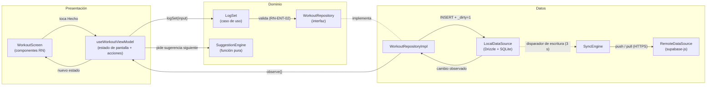
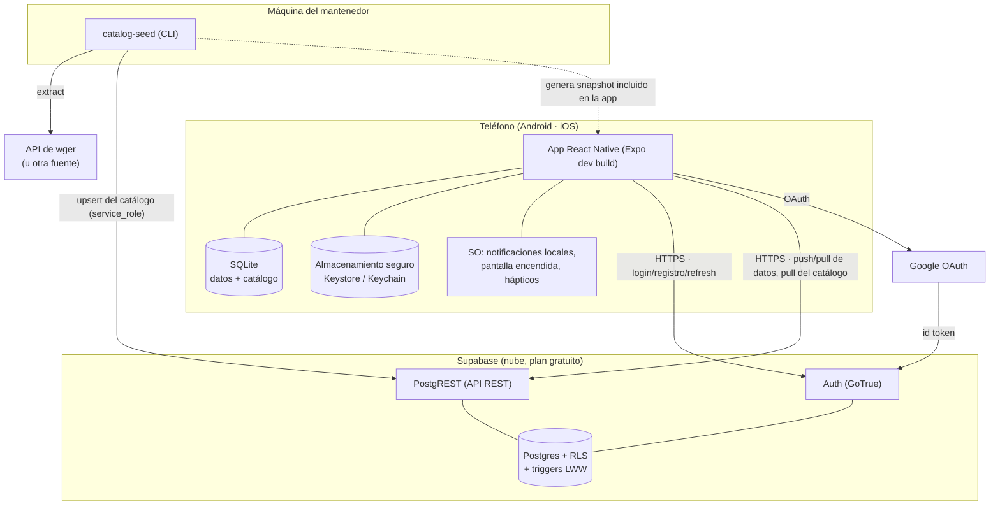

# 12 — Arquitectura

Responde al §4.11 del TPO: diagramas de **flujo de datos** y de **topología de infraestructura**, y las responsabilidades de cada capa.
**ADR:** [0011](adr/0011-mvvm-clean-en-react-native.md) (capas y estado), [0010](adr/0010-base-local-sqlite-drizzle.md) (base local), [0009](adr/0009-motor-como-funcion-pura.md) (motor), [0001](adr/0001-supabase-directo-sin-backend-propio.md) (remoto), [0007](adr/0007-react-native-con-expo.md) (Expo), [0012](adr/0012-soporte-ios.md) (iOS).

## 1. Capas y responsabilidades

| Capa | Contiene | Depende de | No puede depender de |
|---|---|---|---|
| **Presentación** | Pantallas (Expo Router), componentes, **ViewModels** (hooks `useXViewModel`), estado de pantalla, textos | Dominio (casos de uso, modelos) | Datos, SDKs de Supabase o SQLite |
| **Dominio** | Modelos, **reglas** (motor, próximo día, e1RM, volumen), **casos de uso**, **interfaces** de repositorios y servicios | Nada (TypeScript puro) | Presentación, Datos, React, Expo |
| **Datos** | Implementaciones de repositorios, `LocalDataSource` (Drizzle/SQLite), `RemoteDataSource` (supabase-js), mappers fila ↔ modelo, motor de sync | Dominio (implementa sus interfaces) | Presentación |

**Regla de dependencias** (Clean Architecture): las flechas apuntan **hacia el dominio**. Se verifica con lint en CI (RNF-11).

## 2. Flujo de datos

Ejemplo: confirmar una serie (RF-ENT-02).



**Por qué así:**
- La UI **nunca espera a la red**: la escritura termina en SQLite y la UI se actualiza porque **observa** la base local (RN-SYNC-01).
- La sync es un proceso **aparte** de la interacción.
- El motor está en el dominio y no conoce ni SQLite ni React, así que se prueba con tablas de casos (RNF-15).

## 3. Topología de infraestructura



**No hay backend propio** (ADR-0001). La app **nunca** habla con wger (ADR-0004).

## 4. Estado (MVVM)

| Tipo de estado | Dónde vive | Ejemplo |
|---|---|---|
| **Estado de pantalla** | ViewModel (hook) | `{ status: 'loading' \| 'content' \| 'empty' \| 'error', data, … }` de la pantalla de historial |
| **Estado global de la app** | Store de Zustand | dueño actual (invitado o usuario), estado de sync, entrenamiento en curso |
| **Datos persistentes** | SQLite (fuente de verdad) | rutinas, entrenamientos |
| **Datos derivados** | Se calculan en el dominio | sugerencias, próximo día |
| **Estado efímero de UI** | `useState` del componente | texto del buscador, modal abierto |

Cada ViewModel expone un **estado explícito como unión discriminada** y **acciones**:

```ts
type HistoryState =
  | { status: 'loading' }
  | { status: 'empty' }
  | { status: 'content'; workouts: WorkoutSummary[] }
  | { status: 'error'; message: string; retry: () => void };

function useHistoryViewModel(): { state: HistoryState; openWorkout(id: string): void } { /* … */ }
```

## 5. Estructura de carpetas (propuesta)

```
app/                         # Expo Router: una ruta = una pantalla (solo composición de vistas)
src/
  domain/
    models/                  # Routine, Workout, Exercise, …
    rules/                   # suggestion-engine/, next-day.ts, e1rm.ts, volume.ts
    usecases/                # LogSet.ts, StartWorkout.ts, …
    repositories/            # interfaces: WorkoutRepository, …
  data/
    local/                   # schema.ts (Drizzle), migrations/, daos
    remote/                  # supabase client, RemoteDataSource
    repositories/            # implementaciones
    mappers/
    sync/                    # SyncEngine
  presentation/
    features/<feature>/      # componentes + useXViewModel.ts
    components/              # sistema de diseño
    strings/                 # textos en español, centralizados
  di/                        # composition root: crea repos y casos de uso y los provee por Context
tools/catalog-seed/          # ADR-0004
supabase/migrations/         # SQL: tablas, RLS, triggers
```
